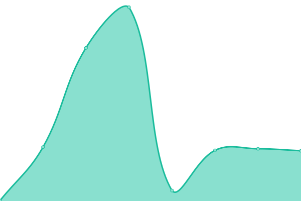
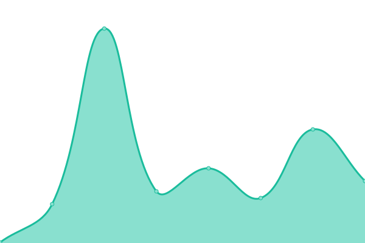

# [📈 Live Status](https://cssudii.github.io/uptime): <!--live status--> **🟩 All systems operational**

This repository contains the open-source uptime monitor and status page for [CSSUDII](https://cssudii.tk), powered by [Upptime](https://github.com/upptime/upptime).

With [Upptime](https://upptime.js.org), you can get your own unlimited and free uptime monitor and status page, powered entirely by a GitHub repository. We use [Issues](https://github.com/lucaslah/uptime/issues) as incident reports, [Actions](https://github.com/lucaslah/uptime/actions) as uptime monitors, and [Pages](https://lucaslah.github.io/uptime) for the status page.

<!--start: status pages-->
<!-- This summary is generated by Upptime (https://github.com/upptime/upptime) -->
<!-- Do not edit this manually, your changes will be overwritten -->
<!-- prettier-ignore -->
| URL | Status | History | Response Time | Uptime |
| --- | ------ | ------- | ------------- | ------ |
|  [WE-BT16 Website](https://we-bt16.netlify.app) | 🟩 Up | [we-bt-16-website.yml](https://github.com/CSSUDII/uptime/commits/master/history/we-bt-16-website.yml) | 

 255ms
     
 | 

<a href="https://CSSUDII.github.io/uptime/history/we-bt-16-website">100.00%</a>
    

|  [PM2](https://app.pm2.io) | 🟩 Up | [pm-2.yml](https://github.com/CSSUDII/uptime/commits/master/history/pm-2.yml) | 

 154ms
     
 | 

<a href="https://CSSUDII.github.io/uptime/history/pm-2">100.00%</a>
    

|  [WE-BT16 Discord Bot (API)](https://834fc166c81e.ngrok.io) | 🟩 Up | [we-bt-16-discord-bot-api.yml](https://github.com/CSSUDII/uptime/commits/master/history/we-bt-16-discord-bot-api.yml) | 

 1607ms
     
 | 

<a href="https://CSSUDII.github.io/uptime/history/we-bt-16-discord-bot-api">100.00%</a>
    

<!--end: status pages-->

[**Visit our status website →**](https://cssudii.github.io/uptime)

## 📄 License

- Powered by: [Upptime](https://github.com/upptime/upptime)
- Code: [MIT](./LICENSE) © [lucaslah](https://cssudii.tk)
- Data in the `./history` directory: [Open Database License](https://opendatacommons.org/licenses/odbl/1-0/)
